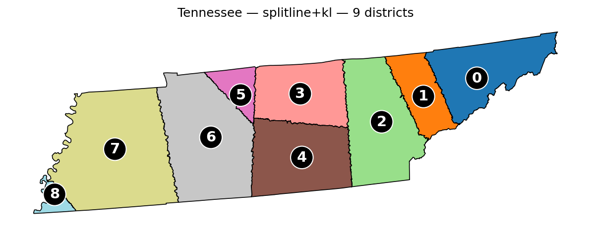

# DistrictMaker

A proposal: that Congressional districts should be drawn by pure geometry — minimizing the boundary line between districts, balancing population, and ignoring everything else.



*Tennessee, 9 districts: the current leader against the realized-boundary objective (METIS + Kernighan-Lin refinement). Per-district population within 0.5% of ideal. See [`docs/convergence-2026-05-15.md`](docs/convergence-2026-05-15.md) for the full cross-algorithm comparison.*

## The thesis

Gerrymandering is the practice of starting from a desired outcome and drawing district lines until you reach it. The defense against it is not a better mapmaker — any mapmaker with a goal of its own can be captured. The defense is removing the outcome-targeting human from the loop. A line drawn to minimize a neutral, stated quantity cannot be drawn to a predetermined partisan end, because no one chose the end.

So the thesis is about **who holds the pen**, not about any particular algorithm. The pen is held by an objective: **minimize the total length of the boundary that actually exists between districts** — traced along census block edges, the geographic units where votes are actually tallied — while keeping each district's population within 0.5% of the state's ideal.

Everything else is deliberately excluded: partisan balance, racial composition, communities of interest, county and municipal preservation, incumbency, and prior plans. This is a values choice, not an oversight — a position about what should count as neutral, not an absence of values. Real-world adoption would require, among other things, a Constitutional amendment.

The algorithms in this repository — shortest-splitline, METIS, simulated annealing, Kernighan-Lin refinement — are *experiments* in service of that objective, not competitors for a "production" title. Each is legitimate insofar as it produces a shorter realized boundary on a given state; none is privileged a priori. Human judgment re-enters only where a genuine statistical question demands it, never to choose where a line falls.

## The proposal

Representative democracy requires that voters choose their representatives. Gerrymandering inverts that arrangement: representatives, or the parties that elect them, draw the lines that determine who their constituents will be. When those in power can shape the rules that select their successors, the consent of the governed becomes notional — this is the foundational corruption that any reform of redistricting must address.

Standard reforms — independent commissions, ranked-choice voting, statutory fairness criteria — try to constrain the discretion that produces gerrymandering. Each one relocates the discretion rather than eliminating it: some human judgment remains in the loop, and that judgment is what gerrymandering exploits.

The alternative pursued here is to reduce human judgment in line-drawing to the greatest extent possible. Districts are produced by procedures with no preferences to encode: minimize the realized boundary between districts, balance population to within 0.5%, accept the shapes that fall out. No single procedure is anointed — several are run as experiments against that one objective, and where they disagree the shorter realized boundary settles it. What follows is what they produce across the 44 multi-district U.S. states.

## Method

- **Geographic unit:** 2020 census blocks, full polygonal geometry (not centroids).
- **Objective:** total length of district boundaries traced along *realized* block edges. This figure is 3–5× larger than the straight-line chord some splitline implementations report, and is the only one that corresponds to the actual political-geographic line between districts.
- **Algorithms:** several partitioners are run against the objective as independent experiments — shortest-splitline, METIS, and simulated annealing — each optionally followed by Kernighan-Lin local refinement on the block adjacency graph. None is the designated "production" method; [`docs/convergence-2026-05-15.md`](docs/convergence-2026-05-15.md) shows how they compare across all 44 states.
- **Population tolerance:** ≤ 0.5% deviation from each state's ideal district population.

Algorithm detail: [`docs/algorithms.md`](docs/algorithms.md). Cross-algorithm comparison: [`docs/convergence-2026-05-15.md`](docs/convergence-2026-05-15.md). Metric definitions and the realized-vs-chord distinction: [`docs/metrics.md`](docs/metrics.md).

## Results

All 44 multi-district states have been processed. (Six states — AK, DE, ND, SD, VT, WY — have a single congressional district and are not partitioned.)

The per-state directories under [`outputs/`](outputs/) render the current leader for that state — the algorithm that produced the shortest realized boundary in the 2026-05-15 sweep across the six-algorithm bake-off. Each state's full ranking lives at `outputs/<STATE>/leader.md`; the cross-state ledger is at [`outputs/summary.md`](outputs/summary.md). Full study writeup: [`docs/convergence-2026-05-15.md`](docs/convergence-2026-05-15.md).

Browse per-state outputs under [`outputs/`](outputs/). Cross-state ledger: [`outputs/summary.md`](outputs/summary.md) (human-readable) or [`outputs/summary.json`](outputs/summary.json) (machine-readable).

Each per-state directory (e.g. [`outputs/TN/`](outputs/TN/)) contains:

| File | Contents |
|---|---|
| `districts.png` | Rendered map |
| `districts.geojson` | District polygons (WGS84) |
| `districts.shp` (+ `.shx`, `.dbf`, `.prj`, `.cpg`) | ESRI shapefile |
| `metrics.json` | Boundary length, compactness scores, per-district population and deviation |
| `run.log` | Parameters, runtime, commit hash |

## Assumptions and limits

Stated rather than buried:

- **Block granularity is discrete.** The boundary length is measured along block-edge segments. A continuous-geometry formulation would have a lower minimum than the block-edge formulation; this implementation cannot reach it.
- **Local search, no global guarantee.** Every algorithm here is a local search; none certifies a global optimum. The convergence study in [`docs/convergence-2026-05-15.md`](docs/convergence-2026-05-15.md) shows, across all 44 states, that Kernighan-Lin is a reliable local optimizer but that the *seed* determines which basin a run settles in — the leader across the six-algorithm bake-off splits three ways by district count (bare METIS on 2–3 district states, METIS+KL across the mid-range, splitline-realized+KL on both of the largest, CA and TX). The reported result for a state is the shortest realized boundary found, not a proven optimum.
- **No demographic input.** No race, no party, no incumbency, no county or municipal preservation, no Voting Rights Act considerations, no communities of interest, no Polsby-Popper / Reock / Schwartzberg overlay. The boundary metric is the only objective.
- **0.5% population tolerance is fixed.** Tighter tolerances would change the achievable boundary length; the trade-off has not been explored here.
- **Synthetic water edges for islands.** Islands in the block adjacency graph receive a small number of synthetic edges across water to allow contiguous districts. This is an implementation compromise; see [`docs/algorithms.md`](docs/algorithms.md).
- **2020 census data only.** Apportionment and block geometry are frozen at the 2020 redistricting cycle.

## Reproducibility

Requires Python 3.11, 3.12, or 3.13. (GeoPandas wheels for 3.14 are not yet reliable.)

```bash
python3.11 -m venv .venv
source .venv/bin/activate
pip install -U pip
pip install -e ".[dev]"
```

Census geometry and 2020 apportionment data are downloaded and cached in `data/` on first run via [`pygris`](https://github.com/walkerke/pygris). The cache totals several GB; allow time on the initial pull. See [`docs/data-sources.md`](docs/data-sources.md) for detail.

Reproduce a single state:

```bash
districtmaker run --state TN --output outputs/TN/
```

Run the convergence comparison on a state:

```bash
districtmaker compare --state ID --output /tmp/id-compare/
```

Tests:

```bash
pytest
```

## Repo layout

```
src/districtmaker/
├── data/         # TIGER ingestion + block adjacency graph
├── algorithms/   # splitline, metis, annealing, kl_refine
├── metrics/      # internal boundary length, compactness, population
├── viz/          # matplotlib map rendering
├── output/       # GeoJSON / Shapefile / metrics.json / run.log writers
├── pipeline.py   # execute_run — shared by `run` and `validate`
├── compare.py    # cross-algorithm convergence harness
└── validate.py   # tier definitions + per-state batch driver
```

Historical planning document (preserved as an artifact, not the project's framing): [`docs/development-history.md`](docs/development-history.md).

## Acknowledgments

Census geometry and 2020 P.L. 94-171 apportionment data from the U.S. Census Bureau's TIGER/Line dataset, accessed via [`pygris`](https://github.com/walkerke/pygris).

Implementation developed with AI-assisted tooling; methodology, value choices, and result verification are the author's.

License: see [`LICENSE`](LICENSE).
