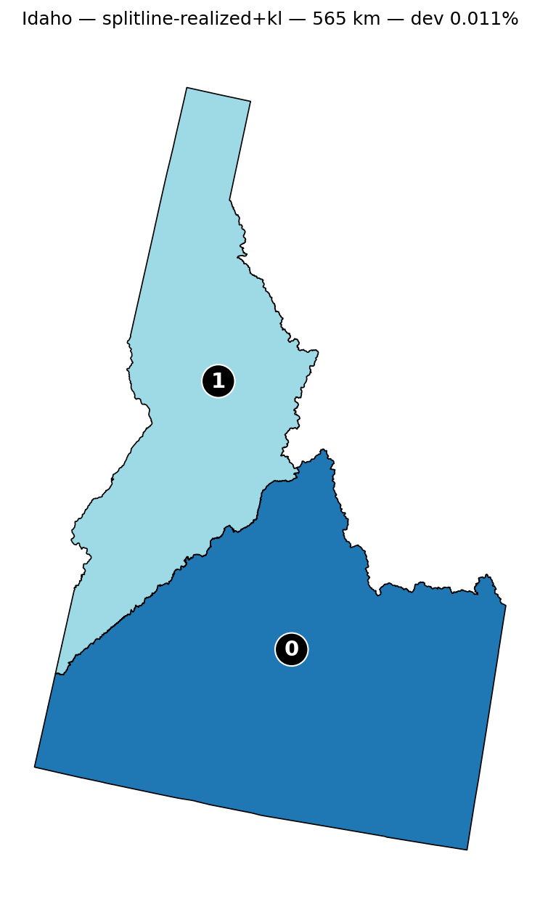
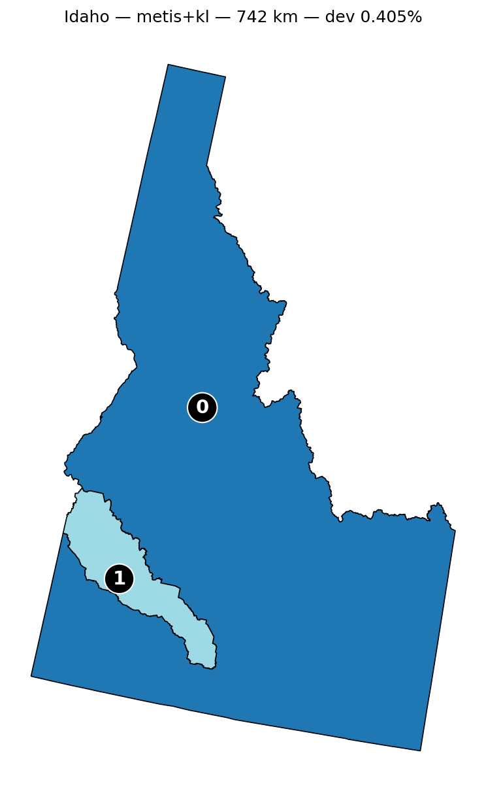
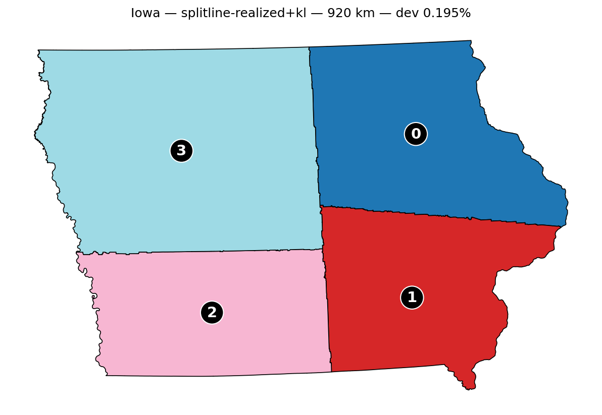
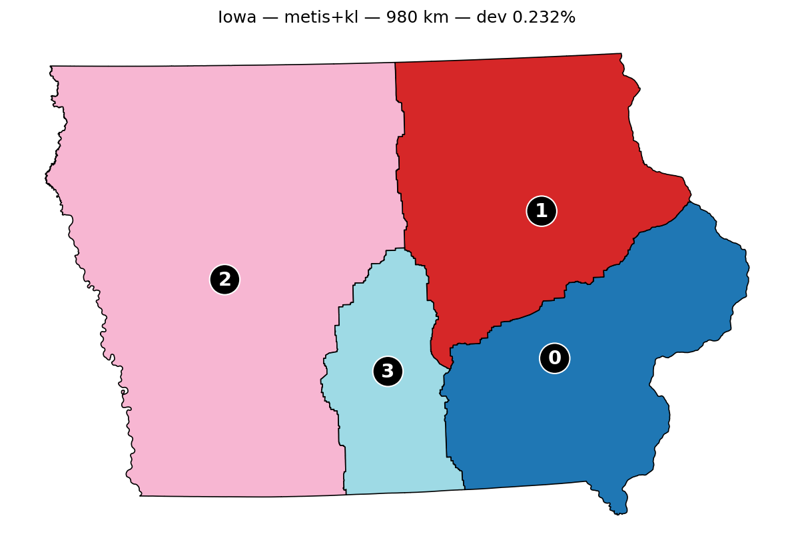

# Cross-Algorithm Convergence Study (n = 44)

Every algorithm in DistrictMaker is a local search against the same objective — realized internal district boundary length — with a hard population constraint. None offers a global-optimality guarantee. This page documents what happens when independent search methods are run against that shared objective across all 44 multi-district U.S. states: where they agree, where they diverge, and what the divergence reveals.

## Method

For each of the 44 multi-district states, the comparison harness (`districtmaker compare`) runs several independent searches against the realized-boundary objective:

1. **Shortest splitline** seeds a partition by recursive population-balanced bisection; **Kernighan-Lin (KL)** refinement post-processes it on the block adjacency graph.
2. **METIS** (`pymetis`), an industry-standard multilevel graph partitioner, produces a partition under a population-balance constraint; KL refines it.
3. **Simulated annealing** searches the dual-graph partition space, both from a random seed and from the splitline+KL result.
4. **Splitline-chord** — the legacy objective (straight cut-line length rather than realized boundary) — is run as a historical baseline.

The question is not "which algorithm is best." It is: *given a shared, neutral objective, do independent methods converge on the same partition — and if not, what does the gap mean?*

## Results (2026-05-14, n = 44)

| Finding | Value |
|---|---|
| **KL == SA-from-KL exactly** | **44 / 44** — Δ = 0 on every state |
| METIS+KL produces the shorter realized boundary | **35 / 44** |
| splitline+KL produces the shorter realized boundary | 9 / 44 |
| Median gap (METIS vs. splitline, signed) | **−5.65%** (METIS shorter) |
| Mean gap | −6.52% |
| Range | UT −39.68% … ID +31.31% |
| Algorithm failures (splitline, METIS, SA, all +KL) | **0 / 44** |
| splitline-chord (legacy proxy) failures | 33 / 44 — known-brittle on block-edge geometry; not part of the production story |

### Per-state table

Sorted by gap. Negative gap = METIS+KL found the shorter realized boundary; positive = splitline+KL did. `nD` is the state's congressional district count.

| State | nD | splitline+KL (km) | METIS+KL (km) | Gap | Winner |
|---|--:|--:|--:|--:|:--|
| UT | 4 | 985.8 | 594.6 | −39.68% | METIS |
| AZ | 9 | 2403.0 | 1606.5 | −33.15% | METIS |
| ME | 2 | 250.6 | 187.9 | −25.02% | METIS |
| NM | 3 | 1043.4 | 804.7 | −22.88% | METIS |
| OR | 6 | 1299.2 | 1007.2 | −22.48% | METIS |
| NH | 2 | 138.6 | 110.6 | −20.19% | METIS |
| CT | 5 | 405.3 | 342.1 | −15.61% | METIS |
| CO | 8 | 1751.7 | 1527.4 | −12.81% | METIS |
| LA | 6 | 1352.4 | 1196.1 | −11.56% | METIS |
| TN | 9 | 1548.2 | 1375.3 | −11.17% | METIS |
| MD | 8 | 632.2 | 569.4 | −9.93% | METIS |
| MS | 4 | 888.4 | 809.0 | −8.94% | METIS |
| RI | 2 | 51.9 | 47.3 | −8.76% | METIS |
| KS | 4 | 906.7 | 827.6 | −8.73% | METIS |
| OK | 5 | 1285.3 | 1176.5 | −8.46% | METIS |
| MT | 2 | 685.2 | 631.4 | −7.84% | METIS |
| FL | 28 | 3855.9 | 3554.9 | −7.81% | METIS |
| NJ | 12 | 732.2 | 686.9 | −6.18% | METIS |
| HI | 2 | 47.0 | 44.1 | −6.05% | METIS |
| WV | 2 | 301.0 | 282.9 | −6.02% | METIS |
| AL | 7 | 1680.9 | 1582.6 | −5.85% | METIS |
| KY | 6 | 1024.4 | 965.3 | −5.77% | METIS |
| SC | 7 | 1269.9 | 1199.6 | −5.53% | METIS |
| MA | 9 | 628.9 | 595.6 | −5.29% | METIS |
| PA | 17 | 2408.7 | 2290.4 | −4.91% | METIS |
| GA | 14 | 2427.0 | 2308.1 | −4.90% | METIS |
| VA | 11 | 1677.9 | 1598.5 | −4.73% | METIS |
| NC | 14 | 2301.6 | 2199.1 | −4.45% | METIS |
| MI | 13 | 2208.6 | 2119.5 | −4.04% | METIS |
| OH | 15 | 2269.0 | 2186.9 | −3.61% | METIS |
| NE | 3 | 425.6 | 410.3 | −3.61% | METIS |
| MN | 8 | 1332.9 | 1289.3 | −3.27% | METIS |
| IL | 17 | 2113.0 | 2054.2 | −2.78% | METIS |
| NY | 26 | 2247.2 | 2207.0 | −1.79% | METIS |
| WI | 8 | 1629.0 | 1615.0 | −0.86% | METIS |
| WA | 10 | 2041.2 | 2058.5 | +0.84% | splitline |
| AR | 4 | 973.3 | 986.6 | +1.36% | splitline |
| CA | 52 | 7323.7 | 7468.0 | +1.97% | splitline |
| NV | 4 | 907.9 | 927.8 | +2.19% | splitline |
| IN | 9 | 1365.8 | 1413.3 | +3.47% | splitline |
| IA | 4 | 919.8 | 980.4 | +6.60% | splitline |
| TX | 38 | 8323.9 | 8967.9 | +7.74% | splitline |
| MO | 8 | 1687.4 | 1892.6 | +12.16% | splitline |
| ID | 2 | 565.4 | 742.5 | +31.31% | splitline |

## Reading the numbers

Three facts carry the study.

**1. KL is a perfectly reliable local optimizer.** Simulated annealing started from a KL result fails to improve it on all 44 states — Δ = 0, every time. KL walks a partition strictly downhill via population-feasible boundary-block swaps until no improving move exists, and SA cannot tunnel out of where it lands. KL is not the variable. Whatever it is handed, it descends to the true local minimum of that basin.

**2. The seed determines the basin.** splitline+KL and METIS+KL apply *the same* KL refinement against *the same* objective on *the same* state — and still diverge by as much as 40 percentage points. The only difference between them is the starting partition. splitline carves an initial cut by recursive geometric bisection; METIS reaches its starting point by multilevel coarsening. Those two seeds drop KL into different basins, and KL cannot cross between them. Convergence, where it happens, is convergence *within a basin*, not agreement *on the global minimum*.

**3. METIS usually finds the shorter boundary, but not always.** Across 44 states METIS+KL wins 35 and splitline+KL wins 9. This reverses the earlier two-state (Idaho, Iowa) reading, in which splitline+KL looked like the stronger seed and METIS "the worse basin." At n = 2 that was sampling noise. At n = 44, neither seed dominates — and the cases where splitline wins include some of its largest margins (ID +31%, MO +12%).

## What predicts the gap?

The 44 results were tested against district count, total population, land area, and population density.

**Geography does not predict *which* algorithm wins.** Population density correlates with the signed gap at −0.01 — effectively zero. Signed gap against district count is only +0.23. The cleanest illustration: **Idaho (splitline +31.3%) and Utah (METIS −39.7%) have nearly identical profiles** — both low-density, few-district interior-West states — and they fall on opposite ends of the entire 44-state range. You cannot look at a state's shape, size, or density and know which seed will produce the shorter boundary.

**District count cleanly predicts the gap's *magnitude*.** The correlation between |gap| and log(district count) is −0.38, and the buckets are unambiguous:

| Districts | n | mean \|gap\| | gap range |
|---|--:|--:|--:|
| 2–3 | 9 | 14.6% | −25.0% … +31.3% |
| 4–6 | 11 | 11.9% | −39.7% … +6.6% |
| 7–12 | 14 | 8.2% | −33.1% … +12.2% |
| 13+ | 10 | **4.4%** | **−7.8% … +7.7%** |

The more districts a state has, the less the seed matters. With many districts the final partition is the aggregate of many cuts, and the two seeds wash out toward each other — every state with 13 or more districts lands within ±8%. With 2–6 districts, a single early cut through mostly-empty land determines almost the entire partition, and the gap can be enormous in *either* direction.

**Why this matters for the project.** If geography predicted the winner, you could pick an algorithm per state on principled grounds. It does not. The only honest procedure is to run every algorithm and let the objective — shortest realized boundary — decide, state by state. The study does not select a production algorithm; it removes the basis for selecting one a priori.

## Visual comparison

Two states where splitline+KL produces the shorter boundary — both shown because their map images are checked into the repo, not because they are representative (they are two of the nine splitline wins). On the 35 METIS-win states the geometric relationship is inverted: METIS's partition is shorter, and often visibly less blocky.

### Idaho — splitline+KL wins (+31.3%)

| Splitline + KL (565 km) | METIS + KL (742 km) |
|---|---|
|  |  |

Idaho is splitline's largest win in the study. The recursive bisection happens to land its single interior cut almost exactly where the realized boundary is shortest; METIS's coarsening reaches a different, longer-boundary basin.

### Iowa — splitline+KL wins (+6.6%)

| Splitline + KL (920 km) | METIS + KL (980 km) |
|---|---|
|  |  |

A smaller splitline win. The interior boundary placement differs visibly even though both partitions are valid and population-balanced.

## What this is and isn't

This is **empirical evidence**, at n = 44, that:

- KL is a dependable local optimizer (SA cannot escape a KL minimum on any state).
- The objective landscape has multiple basins, and the seed — not the refinement — decides which one a run lands in.
- No geographic feature predicts which seed wins; district count predicts only how large the gap can be.

It is **not** a proof of global optimality, and it does not crown a production algorithm. The correct way to cite a state's result is "the shortest realized boundary found across the algorithms run," with the full per-algorithm ledger alongside it — not "optimal," and not "the splitline result" or "the METIS result." When a new algorithm or a multi-start variant finds a shorter boundary on some state, that is the expected mode of progress, not an anomaly.

## Reproducing

```bash
districtmaker compare --state ID --output /tmp/id-compare/
districtmaker compare --state UT --output /tmp/ut-compare/
```

The numbers on this page reflect the codebase as of 2026-05-14. Re-run `compare` for live numbers before citing externally — the algorithms continue to evolve.
